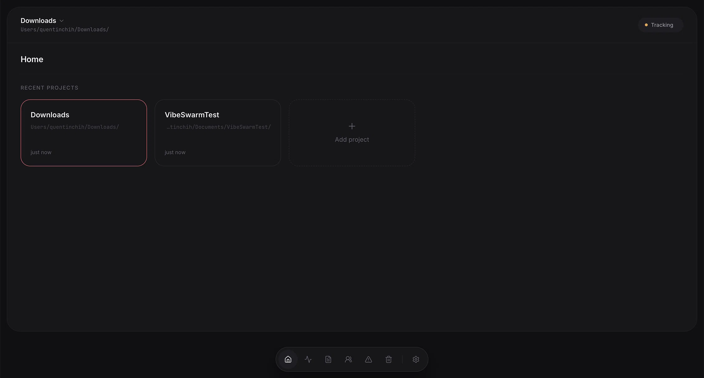
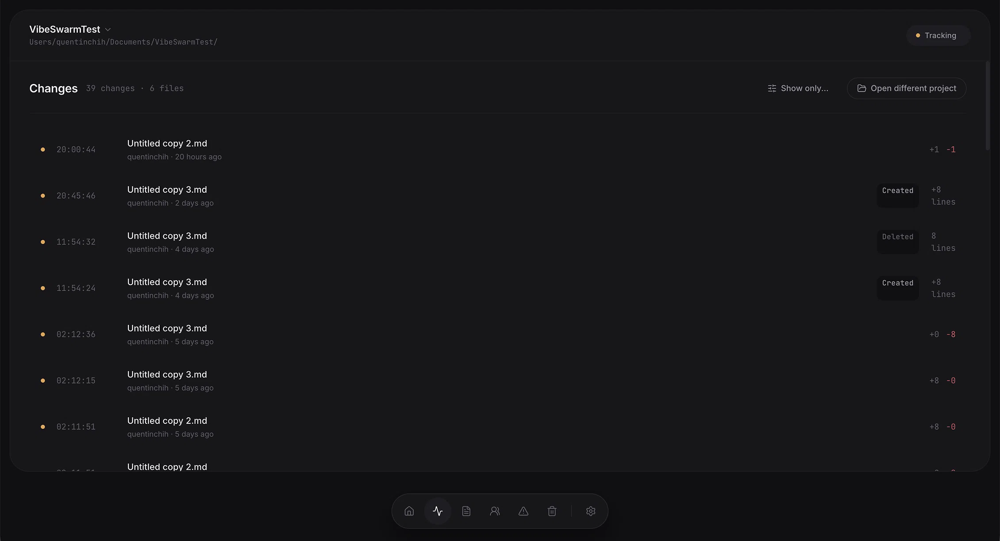
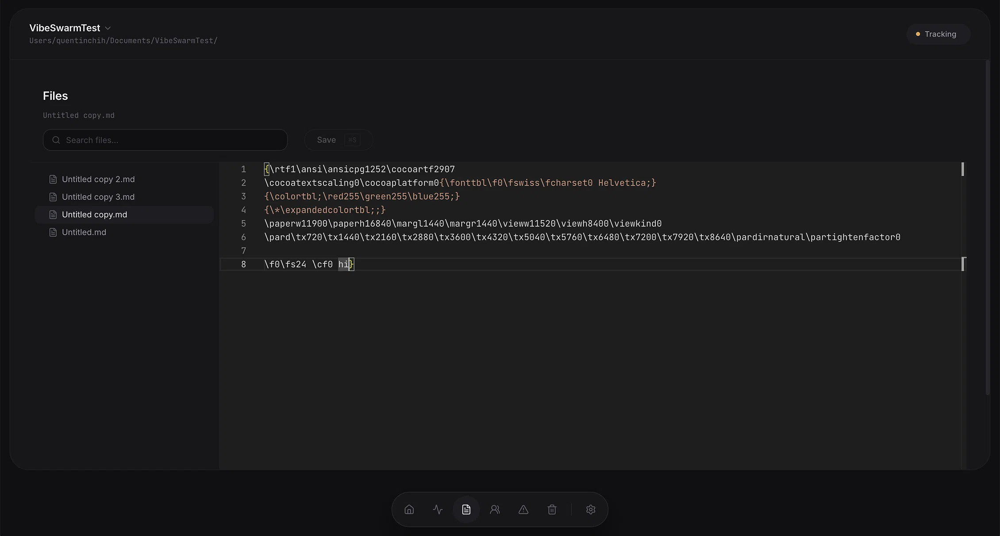

# Cairn

Local-first collaboration for developers and AI coding agents. Cairn watches a shared project on your local network, makes changes understandable, and keeps recovery close at hand.

## Why

When people and AI coding agents edit the same codebase, it is easy to lose context before a conflict happens. Cairn keeps a local activity trail, surfaces overlap risk early, and provides safe recovery tools when a change needs attention.

- **Local-first** — your code never leaves your computer unless you share it
- **P2P** — no server, no accounts, no cloud
- **AI-friendly** — works with any editor and any AI coding tool

## Features

- Real-time local-network collaboration with human and AI change attribution
- File-grouped activity sessions, filters, search, and full Monaco diffs
- Early overlap awareness plus confirmed-conflict review and resolution
- Safe checkpoints, per-file comparison, stale-restore protection, and recovery snapshots
- Invite-code project sharing, download, direct-connection fallback, and peer health diagnostics
- Binary asset sync for supported images and fonts
- GitHub PR export, deleted-file recovery, Quick Open, and keyboard navigation
- A fully isolated Hackathon Mode for presenting the collaboration and recovery story without touching a real project

## Screenshots

### Home



Manage multiple projects. Click a card to start syncing it with your team.

### Changes



Every file change appears here in real time. Click any row to see the full diff.

### Files with built-in editor



Browse your project, preview files with syntax highlighting, and edit directly in Cairn.

The current UI also includes grouped Activity sessions, Team Health, Conflict Center, Checkpoints, and Hackathon Mode. Replace the three screenshots above with current captures before a public announcement; the existing images predate those screens.

## Download

### macOS

1. Download the latest `.dmg` from [Releases](https://github.com/lol40560/Cairn/releases)
2. Open the `.dmg` and drag Cairn to Applications
3. First launch: right-click → Open → Confirm (app is not code-signed yet)

### Windows

1. Download the latest `Cairn-Setup-*.exe` from [Releases](https://github.com/lol40560/Cairn/releases)
2. Double-click to install
3. If SmartScreen warns: More info → Run anyway (app is not code-signed yet)

## Requirements

Cairn works over your **local network**. All teammates must be on the same WiFi or the same hotspot.

If automatic discovery doesn't work, use the **Direct connection** feature:

1. The host opens Team view
2. Scroll down to find "Direct connection" showing something like `192.168.1.5:49500`
3. Copy that address
4. Teammates enter it in the "Join a team" input box

## Common issues

**"Cairn.app is damaged and can't be opened" (macOS)**

The app is not code-signed yet. After downloading, run:

```bash
xattr -cr /Applications/Cairn.app
```

Then open the app normally.

**Windows: SmartScreen blocks the app**

Click "More info" → "Run anyway".

**Teammates can't find each other**

- Make sure you're on the same WiFi or hotspot
- Try the Direct connection feature (see above)
- If on a corporate or campus WiFi, AP isolation may block device-to-device traffic — use a phone hotspot instead

## Quick Start

### Start a new team

1. Open Cairn
2. Choose a project folder
3. Click "Start a team"
4. Share the invite code with teammates

### Join a team

1. Open Cairn
2. Click "Join a team"
3. Enter the invite code (or IP:port if discovery fails)
4. Choose where to save the project
5. Click "Get files"

## How it works

Cairn watches your project folder for changes. When a file changes, it generates a local change event, stores it locally, and broadcasts it to teammates over the local network. It does not claim convergence acknowledgement: “Watching”, “Connected”, “Reconnecting”, and “Offline” describe what Cairn can actually observe.

- Changes are tracked in `.cairn/` inside your project
- Deleted files go to `.cairn/trash/` for 30 days
- A shadow git repo runs in the background — export to GitHub PR anytime
- Checkpoints create recoverable snapshots before destructive restore and conflict-resolution actions

## Shortcuts

- `Cmd/Ctrl + P` — Quick Open
- `Cmd/Ctrl + K` — Command Palette
- `Cmd/Ctrl + S` — Save the open file
- `Cmd/Ctrl + 1–5` — Home, Activity, Files, Team, Conflicts
- `Cmd/Ctrl + ,` — Settings
- In Hackathon Mode, `←` / `→` changes the scene when focus is not in an editor

## Development

### Requirements

- Node.js 20+
- npm

### Commands

```bash
npm install         # install dependencies
npm run dev         # run in development
npm test            # run tests
npm run lint        # lint
npm run build       # build for production
npm run dist:mac    # build macOS app
npm run dist:win    # build Windows app (on Windows)
```

## Known limitations

- Cairn does not claim confirmed full-project convergence because the protocol has no acknowledgement model.
- Session rollback remains analysis-only; a safe three-way revert is not implemented.
- Binary conflict comparison is limited to metadata rather than a visual binary diff.
- macOS and Windows artifacts are not code-signed yet.

## Privacy

Cairn is local-first. We don't collect any data. See [PRIVACY.md](./PRIVACY.md).

## License

MIT — see [LICENSE](./LICENSE).

Third-party attributions are in [THIRD_PARTY_NOTICES.md](./THIRD_PARTY_NOTICES.md).
